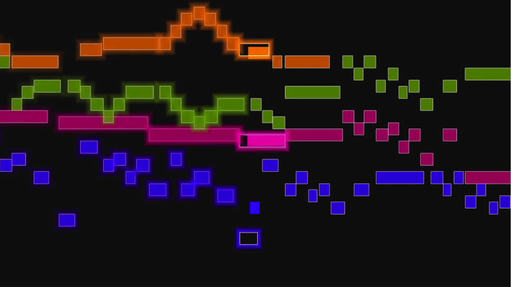
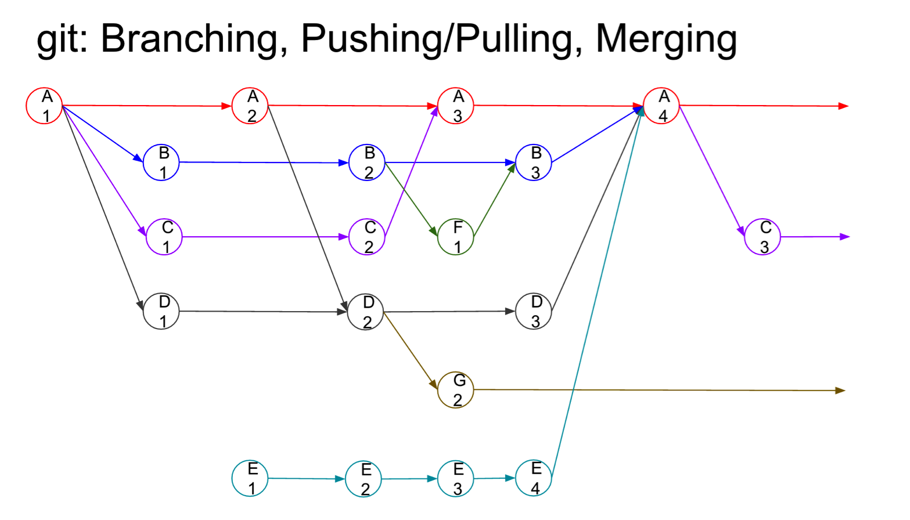
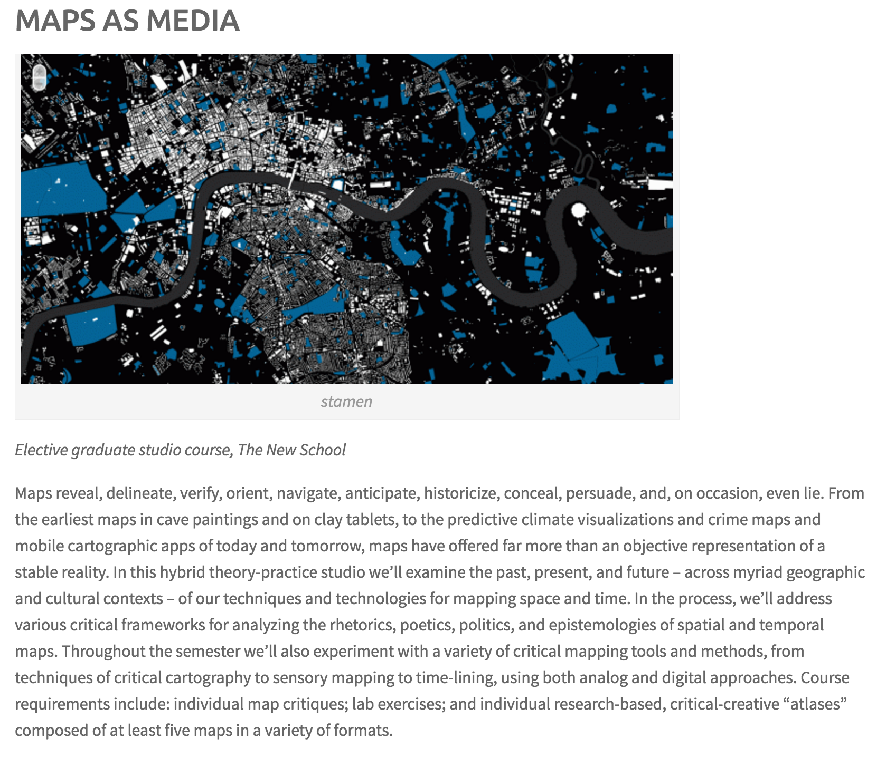

# Iteration

## AUTHOR(S)
Annette Vee
University of Pittsburgh | http://annettevee.com/

---

##### Publication Status:
* unreviewed draft
* draft version undergoing editorial review
* draft version undergoing peer-to-peer review
* published

---

## CURATORIAL STATEMENT (roughly 750-800 words, MLA Format)

One of the many places we can see the influence of the digital computer on how we teach is in our language. Iteration: a hard-edged word, signaling copies, cycles, circuits. Its primary dictionary definitions belong to math and computer science. In these contexts, iteration is working on a problem repetitively, with feedback, to incrementally solve it or improve it. Designers also iterate; they may produce many different versions of a logo or cover or website. As teachers, we repeat similar gestures, assignments and approaches each term; read evaluations and self-evaluate; then return with tweaks for new students, new insights, new contexts. We iterate. As Kathi Inman Berens writes in “Interface” for this collection, “the best teachers tweak the assignment iteratively, learning how the students mis/use the interface.”

Iteration may best be defined iteratively, that is, via different versions and near-synonyms: like, but not quite, remix, revision, mashup, adaptation, elaboration, repetition, reworking, signifyin, retelling, doing-over, variation. In a commentary on “iteration” for Jacket 2, Jacob Edmond writes, “I take iteration to encompass a range of poetic practices, including repetition, sampling, performance, versioning, plagiarism, copying, translation, and reiterations across multiple media…iterative poetries emerge out of and respond to the challenges to individuality, agency, authority, cultural identity, and difference posed by new technologies of reproducibility and by globalization.” New affordances of digital media make iteration an especially vibrant form of creative/critical practice.

In non-verbal form, iteration is:

[An audiovisual rendition of “Bach ‘Great’ Fugue in G-minor, BVW 542”, Aug 17, 2013, by Stephen Malinowski, “smalin.”](https://www.youtube.com/watch?v=4WhPUqpaRp4)

A graphical rendition of git’s fork and merge affordances, by Kevin Brock (see his presentation on git as iteration in “Other resources” below).

Iterative pedagogy is influenced by ideas in creative writing, software, and design. Raymond Queneau’s Exercises in Style, in which he tells one story 99 different ways, is frequently an explicit or implicit influence; so is Oulipo poetry, especially Queneau’s combinatorial sonnets in One Hundred Thousand Billion Poems. For Exercises in Style, Queneau explains: “my intention was merely to produce some exercises; the finished product may possibly act as a kind of rust-remover to literature, help to rid it of some of its scabs.” This objective of “rust-removal” is common in the creative writing and design-influenced pedagogy: do something enough times to work beyond the clichés, to make something genuinely new. Aaron Henderson, who teaches studio arts classes at the University of Pittsburgh, begins almost every project asking students to draw a grid and sketch eight versions of it, forcing different approaches. Mary-Jo Valentino, a professional designer who teaches design at The New School, remembers an assignment from her MFA at RISD where she had to make 100 Y’s. After 60 of them, students began to get pretty creative. About “iteration,” she says: “This is basically my entire profession.... with most iterations ending up in the garbage.”

Conversely, Kenneth Goldsmith’s “uncreative writing” also influences iterative pedagogy. Goldsmith (in)famously transcribed an entire day of The New York Times and published it as a 900 page book. The new version has the same words, but an entirely different context and meaning; it’s an iteration of the original. Applied to teaching, “uncreative writing” allows students to recombine or reshape older works for new contexts, as Rachael Sullivan has asked students to do when writing Internet poetry (see below). We might also think of iteration via Henry Louis Gates’ description of signifyin’, a kind of repetition with a difference.

In digital contexts, we often ask our students to iterate. Learning how to write an essay means learning how to revisit and revise. But learning how to compose in digital media involves many different attempts, trial runs, iterations. Try doing this; now try it again, given what you learned about the platform the first time. In a kinetic typography assignment, Kerry Banazek requires students to turn in two minutes of material in either one edited project or several shorter projects. Rather than revise, they can start over again. She notes that, “This lets them decide for themselves if revision is worth it or if (as is often the case) the first 30-seconds they made taught them a lot---which means they want me to see it so they can get credit for all that work---but is so rough that they don't want to keep working with it once they're able to produce things that look sharper” (personal communication, May 13, 2016). In digital pedagogy, iteration often makes more sense than revision, because it gives students a fresh start with new knowledge. Collin Brooke writes,
> I’d argue that one advantage of focusing on iteration (as opposed to revision) is that students experience it non-teleologically. That is, because they often revise their writing in the interests of assessment, they tend to focus on the elimination of error rather than the exploration of viable alternatives. Iteration is about making it different, rather than making it “better,” and eventually, students come to understand how the former can lead to the latter. (personal communication, May 1, 2016)

Below are ten examples of iteration in digital pedagogy, organized into three different objectives:
+ _Iteration for multiple perspectives_: Like Queneau’s exercises, these assignments approach the same story or project from different angles, with the goal being flexibility, creativity, or as Queneau put it, “rust-removal.”
+ _Iteration for proliferation_: Here, the point is the process: what’s learned about a structure or platform by repeating or changing it multiple times.
+ _Iteration for improvement_: Aiming ultimately for improvement, these projects involve cycles, like software: do something; get feedback; do it again; get feedback; do it again.

###Iteration for multiple perspectives

* Atlas for “Maps as Media” course
* Type: Portfolio assignment
* 
* [http://www.wordsinspace.net/mapsmedia/fall2015/requirements-assignments/](http://www.wordsinspace.net/mapsmedia/fall2015/requirements-assignments/)

* Shannon Mattern, New School Graduate Studio
* Maps as Media, Spring 2016

In Shannon Mattern’s masters-level Maps as Media course, students turn in a final portfolio of maps—an atlas—that is comprised of five different mapping approaches to one subject. The course asks students to “experiment with a variety of critical mapping tools and methods, from techniques of critical cartography to sensory mapping to time-lining, using both analog and digital approaches.” Students in Mattern’s Maps as Media and Urban Media Archaeology courses have produced atlases on politics in Sri Lanka, the body, counter-maps to NYPD’s “locations of [Muslim] concern,” and every brewery in Brooklyn from 1840 to the present. In this mapping process, students come to know viscerally the limitations of mapping: “not everything is mappable, and not everything belongs on a map” (Mattern, “Map as Metaphor”).

Maps as Media course website: http://www.wordsinspace.net/mapsmedia/fall2015/
Student examples: http://www.wordsinspace.net/mapsmedia/fall2015/2016/04/03/final-projects/
Earlier versions of class “Urban Media Archaeology” student projects: http://www.wordsinspace.net/wordpress/2013/12/18/mapping_gyros/
Mattern’s reflection on Map as Metaphor, including discussion of this course http://www.wordsinspace.net/wordpress/2016/03/22/map-as-metaphor-center-for-book-arts/

* Title of Artifact (as it appears on the actual "document")
* Artifact Type: Pedagogical artifacts may include (but are not limited to) syllabi, teaching guidelines, assignments, lesson plans, course sites, learning objective, collaborative projects, and even student work.
* Screenshot (PNG or JPG), titled “keyword artifact title,” e.g. “work-AfAm-syllabus.png”
* Source URL
* Artifact Permissions (note whether content is shared under a Creative Commons license)
* Copy of the Artifact (in HTML, PDF, DOCX, TXT, MD, RTF, MP3, MP4, MOV, PNG, or JPG), if possible
* Creator and Affiliation
* An annotation of **no more than 150 words** that includes:
	* Brief statement of aim/purpose of the artifact (what is it?)
	* Brief statement on its relevance to your keyword (why is it important/useful, what does it do well, how does it exemplify digital pedagogy)
	* Guidelines for use (how to integrate it into a course, what might need revision/adaptation)

The curatorial statement expresses your vision of the keyword — what it means in a pedagogical context and how you approached the task of curating pedagogical artifacts around it. Statements can include some or all of the following:

* Vision statement (how do you envision or understand this keyword and its relation to pedagogy?)
* Scholarly rationale for selections
* Criteria for selections (why were the specific curated artifacts selected?)
* Important issues (why teach this now? why does this topic matter for students? for faculty? for a field? what makes this keyword unique or exemplary for digital pedagogy?)
* Particular intersections with your pedagogical philosophy/teaching conditions (how and where do you teach issues related to this keyword? in what course(s)? with what learning expectations/outcomes in mind? with or without what resources? what are your students' backgrounds, interests, or investments?)

Unless it draws upon your first-person experience in the classroom, please limit the use of first person.

## CURATED ARTIFACTS (ten artifacts, each with metadata, a screenshot, and a 150-word annotation)

Select ten pedagogical artifacts (no more, no less) to feature for your keyword. The emphasis should be the everyday stuff of teaching, not after-the-fact reflections on teaching. These artifacts should demonstrate what you and others use to teach your keyword. What teaching and learning projects do you turn to when crafting your teaching materials? What prompts or assignments have inspired you? Which or whose syllabi have you borrowed from, revised, or built upon? Put this way, pedagogical artifacts may include (but are not limited to) syllabi, teaching guidelines, assignments, lesson plans, course sites, learning objective, collaborative projects, and even student work. A balanced variety of artifacts types is optimal. Please note, however, that of the ten annotated artifacts included in every keyword, at least two of them must be assignments or syllabi.

For each of your ten artifacts, please provide:

* Title of Artifact (as it appears on the actual "document")
* Artifact Type: Pedagogical artifacts may include (but are not limited to) syllabi, teaching guidelines, assignments, lesson plans, course sites, learning objective, collaborative projects, and even student work.
* Screenshot (PNG or JPG), titled “keyword artifact title,” e.g. “work-AfAm-syllabus.png”
* Source URL
* Artifact Permissions (note whether content is shared under a Creative Commons license)
* Copy of the Artifact (in HTML, PDF, DOCX, TXT, MD, RTF, MP3, MP4, MOV, PNG, or JPG), if possible
* Creator and Affiliation
* An annotation of **no more than 150 words** that includes:
	* Brief statement of aim/purpose of the artifact (what is it?)
	* Brief statement on its relevance to your keyword (why is it important/useful, what does it do well, how does it exemplify digital pedagogy)
	* Guidelines for use (how to integrate it into a course, what might need revision/adaptation)

Please order the artifacts purposefully -- either alphabetically (according to title or author) or in an order that denotes a different taxonomy (e.g., from beginner to expert level use).

We have begun a list of FAQ in a ReadMe file (https://github.com/curateteaching/digitalpedagogy/blob/master/README.md) in addition to a description of the project (https://github.com/curateteaching/digitalpedagogy/blob/master/description.md) and all other keywords (https://github.com/curateteaching/digitalpedagogy/blob/master/listOfKeywords.md).

Feel free to push these artifacts to a server for remote access, and then send us the URL. Or you can create your own GitHub repo for this work. In your Markdown file, you can just include file names (e.g., keyword screenshot1.png) for our reference, with the annotations and other information following them. Ultimately, all of your artifacts will be integrated in this repository (curateteaching/digitalpedagogy).

Once we receive your entry, we will review and edit it (where necessary), return the proof to you (for approval/revision), and then forward the approved proof to the MLA. The entire GitHub Repository is now available online for view by the public; if you wish your keyword-in-process during this first phase to remain private, please let us know.

Later, the keyword and the entire *Digital Pedagogy in the Humanities* collection will be made available online (open access) for open review. That said, please let us know if you have any questions or concerns about the open review process, or about rendering your work discoverable online. In the interests of transparency, I should note that we are still fleshing out the particulars of this review process with the MLA, and we want to keep our curators' needs and interests in mind as we do so.  

## RELATED MATERIALS

In MLA format, list five related items that are informative for teaching with your keyword in mind. **Please only include five items. No more, no less.**

For each item, include Author, Title, and URL, in alphabetical order.

Items may include, but are not limited to:
* Scholarly journal article
* Book
* Video, audio, or other dynamic media
* Crowdsourced document
* Blog post

## WORKS CITED

A works cited for all references in your entry, including your ten artifacts, your five related materials, and anything referenced in your curatorial statement in MLA style.  
